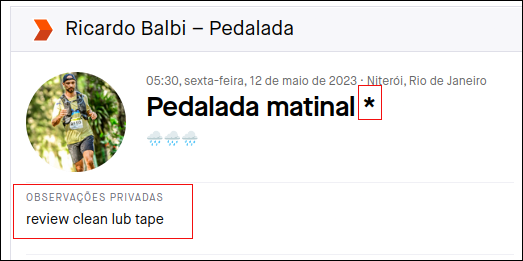

  

## Screens

### Login page

 

### List of equipments

 

### General statistics

 

### Equipment statistics

 

 

### Strava Configuration

## List os equipments:

|      Code      | Equipment                               |
| :------------: | --------------------------------------- |
|      lub       | `Lubrification`                         |
|     review     | `Complete Review`                       |
|     clean      | `Clean`                                 |
|      susp      | `Suspension review`                     |
|                |                                         |
|     tires      | `Both tires`                            |
|   fronttire    | `Front tire`                            |
|    reartire    | `Rear tire`                             |
|     tubes      | `Both tubes`                            |
|    tubeless    | `Tubeless installation or replacement ` |
|   fronttube    | `Front tube`                            |
|    reartube    | `Rear tube`                             |
|                |                                         |
|      stem      | `Stem`                                  |
|   habdlebar    | `Handlebar`                             |
|    wheelset    | `Wheel Set`                             |
|   frontwheel   | `Front Wheel`                           |
|   rearwheel    | `Rear Wheel`                            |
|                |                                         |
|     breaks     | `Both breaks pads`                      |
|   frontbreak   | `Front brak pad`                        |
|   rearbreak    | `Rear break pad`                        |
|                |                                         |
|     disks      | `Both disks`                            |
|   frontDisk    | `Front disk`                            |
|    rearDisk    | `Rear disk`                             |
|                |                                         |
|      tape      | `Handlebar Tape`                        |
|      grip      | `Handlebar Grip`                        |
|    dropper     | `Dropper post`                          |
|     saddle     | `Saddle`                                |
|                |                                         |
|     pedal      | `Pedals`                                |
|     chain      | `Chain`                                 |
|       bb       | `Bottom Bracket`                        |
|                |                                         |
|    cassette    | `Cassette`                              |
|    crankset    | `Crankset`                              |
| rearderailleur | `Rear Derailleur`                       |
|  rearshifter   | `Rear Shifter`                          |
|                |                                         |
|   frontlight   | `Front light`                           |
|   rearlight    | `Rear light`                            |

 

  

  

  

  

  

  

  

## Contribuidores

