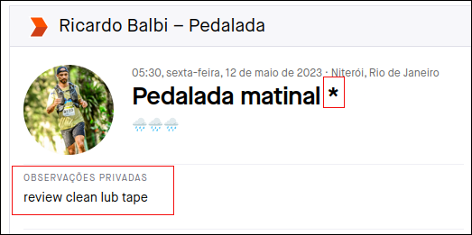

# Strava Stats

🚴 **Strava Next** é uma aplicação web desenvolvida com Next.js que interage com a API do Strava para exibir estatísticas de atividades, equipamentos e outros dados dos usuários.

## 📸 Capturas de Tela

### Login page

|  |  |
| -------------------------------------------------------------------------- | -------------------------------------------------------------------------- |

### List of equipments

|  |  |
| ---------------------------------------------------------------------------------- | ---------------------------------------------------------------------------------- |

### General statistics

|  |  |
| ---------------------------------------------------------------------------------- | ---------------------------------------------------------------------------------- |

### Equipment statistics

|  |  |
| ------------------------------------------------------------------------------------ | ------------------------------------------------------------------------------------ |

<br/>

### Strava Configuration



## List of equipments:

|      Code      | Equipment                               |
| :------------: | --------------------------------------- |
|      lub       | `Lubrification`                         |
|     review     | `Complete Review`                       |
|     clean      | `Clean`                                 |
|      susp      | `Suspension review`                     |
|                |                                         |
|     tires      | `Both tires`                            |
|   fronttire    | `Front tire`                            |
|    reartire    | `Rear tire`                             |
|     tubes      | `Both tubes`                            |
|    tubeless    | `Tubeless installation or replacement ` |
|   fronttube    | `Front tube`                            |
|    reartube    | `Rear tube`                             |
|                |                                         |
|      stem      | `Stem`                                  |
|   handlebar    | `Handlebar`                             |
|    wheelset    | `Wheel Set`                             |
|   frontwheel   | `Front Wheel`                           |
|   rearwheel    | `Rear Wheel`                            |
|                |                                         |
|     breaks     | `Both breaks pads`                      |
|   frontbreak   | `Front brak pad`                        |
|   rearbreak    | `Rear break pad`                        |
|                |                                         |
|     disks      | `Both disks`                            |
|   frontDisk    | `Front disk`                            |
|    rearDisk    | `Rear disk`                             |
|                |                                         |
|      tape      | `Handlebar Tape`                        |
|      grip      | `Handlebar Grip`                        |
|    dropper     | `Dropper post`                          |
|     saddle     | `Saddle`                                |
|                |                                         |
|     pedal      | `Pedals`                                |
|     chain      | `Chain`                                 |
|       bb       | `Bottom Bracket`                        |
|                |                                         |
|    cassette    | `Cassette`                              |
|    crankset    | `Crankset`                              |
| rearderailleur | `Rear Derailleur`                       |
|  rearshifter   | `Rear Shifter`                          |
|                |                                         |
|   frontlight   | `Front light`                           |
|   rearlight    | `Rear light`                            |

## 🚀 Tecnologias Utilizadas

- **Next.js** - Framework React para aplicações web
- **React.js** - Biblioteca para construção de interfaces
- **TypeScript** - Tipagem estática para JavaScript
- **Strava API** - Integração com a plataforma Strava

## 📦 Instalação e Configuração

### 🔹 Pré-requisitos

Antes de iniciar, certifique-se de ter instalado:

- **Node.js** (versão 16 ou superior)
- **Yarn** ou **npm**
- Uma conta de desenvolvedor no **Strava API**

### 🔹 Clonando o Repositório

```sh
 git clone https://github.com/rbalbix/strava-next.git
 cd strava-next
```

### 🔹 Instalando Dependências

Com `npm`:

```sh
npm install
```

Com `yarn`:

```sh
yarn install
```

### 🔹 Configurando Variáveis de Ambiente

Crie um arquivo `.env.local` na raiz do projeto e adicione as seguintes variáveis:

```ini
CLIENT_ID=SEU_CLIENT_ID
CLIENT_SECRET=SEU_CLIENT_SECRET
GRANT_TYPE=authorization_code
RESPONSE_TYPE=code
APPROVAL_PROMPT=auto
STRAVA_SCOPE=read,profile:read_all,activity:read_all
VERIFY_TOKEN=SEU_VERIFY_TOKEN_WEBHOOK
UPSTASH_REDIS_REST_URL=SUA_UPSTASH_REDIS_REST_URL
UPSTASH_REDIS_REST_TOKEN=SEU_UPSTASH_REDIS_REST_TOKEN
RESEND_API_KEY=SUA_RESEND_API_KEY
RESEND_EMAIL_FROM=SEU_EMAIL_FROM
NEXT_PUBLIC_CONTACT_EMAIL=SEU_EMAIL_DE_CONTATO
NEXT_PUBLIC_APP_URL=http://localhost:3000
INTERNAL_API_TOKEN=TOKEN_INTERNO_FORTE
```

🚨 **Atenção**: Nunca compartilhe suas credenciais publicamente!

### 🔹 Executando o Projeto

Com `npm`:

```sh
npm run dev
```

Com `yarn`:

```sh
yarn dev
```

O projeto estará disponível em `http://localhost:3000`

## 🛠️ Estrutura do Projeto

```plaintext
📂 strava-next
 ├── 📁 components    # Componentes reutilizáveis
 ├── 📁 pages         # Páginas da aplicação
 ├── 📁 styles        # Estilos CSS/Tailwind
 ├── 📁 utils         # Funções auxiliares
 ├── .env.local       # Configuração de variáveis ambiente (não versionado)
 ├── package.json     # Configuração do projeto
 ├── README.md        # Documentação
```

## 📡 API do Strava

A aplicação consome a API do Strava para obter dados do usuário. Para mais detalhes sobre os endpoints disponíveis, consulte a documentação oficial:
🔗 [Strava API Docs](https://developers.strava.com/docs/reference/)

## 📈 Métricas e Validação

### Como consultar as métricas

As métricas são expostas em formato Prometheus no endpoint:

```sh
GET /api/metrics
```

Exemplo local:

```sh
curl -s http://localhost:3000/api/metrics
```

Exemplo em produção:

```sh
curl -s https://SEU_DOMINIO/api/metrics
```

Contadores principais monitorados:

- `webhook_events_total`
- `webhook_validation_failed_total`
- `token_refresh_attempts_total`
- `token_refresh_success_total`
- `token_refresh_failure_total`
- `activity_processed_total`
- `activity_failed_total`
- `email_sent_total`
- `email_failed_total`

As métricas são persistidas no Redis para refletir contagem agregada entre instâncias.

### Checklist de validação

1. Confirmar variáveis obrigatórias em ambiente:
   `CLIENT_ID`, `CLIENT_SECRET`, `UPSTASH_REDIS_REST_URL`, `UPSTASH_REDIS_REST_TOKEN`, `INTERNAL_API_TOKEN`.
2. Subir aplicação e validar build:
   `yarn build`.
3. Disparar fluxo de login OAuth e confirmar retorno sem erro.
4. Consultar `/api/metrics` e verificar se os contadores retornam em texto Prometheus.
5. Enviar webhook válido e verificar incremento em `webhook_events_total`.
6. Enviar payload inválido e verificar incremento em `webhook_validation_failed_total`.
7. Simular envio de email interno e validar `email_sent_total` (ou `email_failed_total` em caso de erro).
8. Validar logs estruturados (`pino`) nos módulos de webhook, estatísticas, tokens e email.

## ✅ Melhorias Futuras

- [ ] Melhorar a interface para dispositivos móveis 📱
- [ ] Implementar testes automatizados 🧪
- [ ] Adicionar cache para reduzir chamadas à API 🚀

## 🤝 Contribuição

Contribuições são bem-vindas! Para colaborar:

1. Faça um fork do projeto 🍴
2. Crie uma branch com a nova funcionalidade: `git checkout -b minha-feature`
3. Faça commit das alterações: `git commit -m 'Minha nova feature'`
4. Envie para o repositório remoto: `git push origin minha-feature`
5. Abra um Pull Request 🚀

## 📜 Licença

Este projeto é distribuído sob a licença MIT. Veja mais detalhes no arquivo `LICENSE`.

---

Feito com ❤️ por [rbalbix](https://github.com/rbalbix) 🚴‍♂️

</br>
<div align="center">
  

  

  

  

  

  

  


</div>

## Contribuidores

<a href="https://github.com/rbalbix/strava-stats/graphs/contributors">
  
</a>
